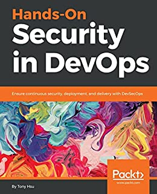

# Resources

{: .no_toc }

## Table of contents
{: .no_toc .text-delta }

1. TOC
{:toc}

---

## Books

### Hands-On Security in DevOps

This guide combines DevOps and security to help you to protect cloud services, and teaches you how to use techniques to integrate security directly in your product. You will learn how to implement security at every layer, such as for the web application, cloud infrastructure, communication, and the delivery pipeline layers. With the help of practical examples, you’ll explore the core security aspects, such as blocking attacks, fraud detection, cloud forensics, and incident response. In the concluding chapters, you will cover topics on extending DevOps security, such as risk assessment, threat modeling, and continuous security.

By the end of this book, you will be well-versed in implementing security in all layers of your organization and be confident in monitoring and blocking attacks throughout your cloud services.

What you will learn
{: .label .label-purple }

Understand DevSecOps culture and organization
Learn security requirements, management, and metrics
Secure your architecture design by looking at threat modeling, coding tools and practices
Handle most common security issues and explore black and white-box testing tools and practices
Work with security monitoring toolkits and online fraud detection rules
Explore GDPR and PII handling case studies to understand the DevSecOps lifecycle
Who this book is for
Hands-On Security in DevOps is for system administrators, security consultants, and DevOps engineers who want to secure their entire organization. Basic understanding of Cloud computing, automation frameworks, and programming is necessary.

Table of Contents
{: .label .label-purple }

* DevSecOps Drivers and Challenges

* Security Goal and Metrics

* Security Assurance Program and Organization

* Security Requirements and Compliance

* Case Study: Security Assurance Program

* Security Architecture, Common Modules Framework, Design Principles

* Threat modeling Practices & Secure Design

* Secure Coding Baseline, Tools and Best Practices

* Case Study: Continuous releases with security by default

* Security Testing Plan and Cases

* WhiteBox Testing Tips

* Security Testing toolkits

* Automation - Key to built-in security CI pipeline

* Incident Response

* Security Monitoring

* Security Scanning for new Releases releases

* Threat Inspection and Intelligence

* Business Fraud, Accounts and Services Abuses detection

* GDPR compliance case study

* DevSecOps Challenges, Tips and FAQ

[Hands-On Security in DevOps](https://www.amazon.com/Hands-Security-DevOps-continuous-deployment/dp/1788995503){: .btn .btn-purple .mr-2 }

### Practical Application Security

A Book About more +15 Vulnerability Type Attack & Defence and Tutorial About Software Security Tools and Appliance.

Table of Contents
{: .label .label-purple }

* Part I: Prepared for Application Security
	* Introduction
	* SDLC vs SSDLC
	* Vulnerability Management
	* Static & Dynamic Testing
	* Secure Architecture

* Part II: Vulnerabilities
	* SQL Injection
	* Code Injection
	* Server Side Template Injection
	* XML Injection
	* What is OAuth?
	* How does OAuth 2.0 work?
	* OAuth 2.0 Misconfiguration
	* What is SAML?
	* How does SAML work?
	* SAML Misconfiguration
	* What is Session Management
	* Session Management Security Best Practice
	* XXE
	* Insecure Deserialization
	* XSS
	* Insecure Deserialization
	* CSRF
	* SSRF
	* HTTP request smuggling
	* Web cache poisoning

* Part III: Secure Application Architecture
	* What is Web Service?
	* Type of Web Service
	* Webservice Misconfiguration
	* What is Authentication?
	* Storage of Credential Security Issue
	* Authentication Misconfiguration
	* What is Credential?
	* Type of Storage
	* Storage Security Risk
	* What is Sensitive/Non-Sensitive File?
	* Sensitive File in Java
	* What are business logic vulnerabilities
	* Depenedency Vulnerability

* Part IV: Virtual Patching
	* Fortiweb WAF
	* Cloudflare WAF
	* References

[Practical Application Security](https://leanpub.com/practicalappsec){: .btn .btn-purple .mr-2 }

## Guidelines

### OWASP DevSecOps Guidelines

The OWASP DevSecOps Guideline explains how we can implement a secure pipeline and use best practices and introduce tools that we can use in this matter. Also, the project is trying to help us promote the shift-left security culture in our development process. This project helps any companies of each size that have a development pipeline or, in other words, have a DevOps pipeline. We try to draw a perspective of a secure DevOps pipeline during this project and then improve it based on our customized requirements.

[OWASP DevSecOps Guideline](https://owasp.org/www-project-devsecops-guideline/latest/){: .btn .btn-purple .mr-2 }

### 6mile DevSecOps Playbook

This playbook will help you introduce effective DevSecOps practices in your company, regardless of size. We provide explicit guidance and actionable steps to introduce security controls, measure their effectiveness, and demonstrate value for money to your business leaders. Following this playbook will help teams build materially more secure applications, and that in the end, is the intent.

[6mile DevSecOps Playbook](https://github.com/6mile/DevSecOps-Playbook){: .btn .btn-purple .mr-2 }

### Aif4thah Dojo-101

Knowledge base in cybersecurity, administration and secure development

[Aif4thah Dojo-101](https://github.com/Aif4thah/Dojo-101){: .btn .btn-purple .mr-2 }

## Framework

### Cloud Adoption Framework

Proven guidance and best practices that help you confidently adopt the cloud and achieve business outcomes.

[Microsoft Cloud Adoption Framework](https://learn.microsoft.com/en-us/azure/cloud-adoption-framework/){: .btn .btn-purple .mr-2 }

## Cheatsheet

Hi! I’m Lars Windolf and my expertise is on system architecture and DevSecOps. I strongly care about collecting and sharing knowledge and use this site as a resource for my daily work.

[lzone](https://lzone.de/cheat-sheet/Container){: .btn .btn-purple .mr-2 }

